# Dynamic Interactive Stock Dashboard
​
## Development Team
​
* Zeray Admasu - *Dashboard Constructor, Code Reviewer*
* Sumitha Prabhu - *NLP -Sentiment Analysis - News Media*
* John A Kelly - *NLP - Sentiment Analysis - Social Media*
* Joanne Gates - *Deep-Learning, LSTM Time Series Analysis*
​
## About This Project
​
The purpose of this project is to create an easy-to-use interactive financial dashboard, intended for a basic, non-professional investors, with little need for tech skills to use, much like the Robinhood app.  The user can call on this dashboard to display real-time information about any SEC publicly-traded stock they are interested in. The dashboard will then output a series of impactful, easy-to-pread visuals:
​
* Historical pricing data.
* Impactful graphs and visuals of the pricing data.
* Time-series price prediction for the target stock.
* Comparative sentiment analysis (both news and social media buzz) about the target stock that could influence a buyer decision.
​
This dashboard will require the user to proivde a **stock ticker** , a **trading period** to return the historical prices covering said timeline. And the built-in python libraries will perform background data scraping and formatting into quick output graphs understandable to the user.  
​
## The Main Dashboard - Zeray Admasu
​
> ## DASHBOARD FOR DAY AND SWING TRADERS

Dashboard is a very useful data visualization tool. We used a python module called dash to create the dashboard. We started by creating an app called stock visualization, and then we created the layout

As shown above, the layout has four inputs and one dropdown menu. The first three inputs accept text the fourth accepts only number numbers. The dropdown menu has three choices. 

After we created the layout, we specified the function of each component. As shown above, the callback function has five components as input, and the result of these five inputs/components is one output graph. 

Input_data: 

    takes a stock ticker
    
period1: 

    takes the range of the data we need ( 1d, 2d , ...) d = day
    
interval1: 

    the gap between each data (1m , 5m , 10m..) m =minuet
    
MA: 

    Moving Average (it takes any number)
    

date: the drop-down menu has three choices.

    1, yesterday: it presents yesterday's performance of the input_data ticker
    
    2, the day before yesterday: it presents the performance of the selected stock two days ago.
    
    3, two days ago:  it presents the performance of the selected stock two days ago.
    

# The final look of the dashboard

All Five inputs are controlled. 

Row 1 , Col 1 : 

    current price for the selected symbol (example BA(The Boeing Company)

Row 2 , Col 1 : 

    The price of the selected stock one day ago. We can change this by selecting a different date from the dropdown menu

Row 1 , Col 2 : 

    Two weeks stock price for the selected stock/symbol

Row 2 , Col 2 : 

    Setiment analysis chart for the selected symbol/stock 

 1 , Col 2  and Row 2 , Col 2 shows the correlation between the price of the stocka nd the setiment analysis. 

​
**Imports and libraries:**
* 
* 
* 
​
​
​
​
## Sentiment Analysis: News Media - Sumitha Prabhu
​
># **Sentiment Analysis for stock news and price trend indicator**

## Steps for the sentiment analysis-price movement.

- ***BeautifulSoup Library***
    - Here BeautifulSoup library is used for webscrapping the news table from the website 'https://finviz.com/quote.ashx?t='
    
    - Using inspect on the webpage we can locate table-id which is then used to scrappe tr (tablerow).
    
    - The news headlines are then converted into a dataframe which is used for sentiment analysis.

    

    
- ***NLTK VADER Library***
    -  NLTK VADER for sentiment analysis is used to find the neutral, postive, negative and compound sentiment for each headline. 

    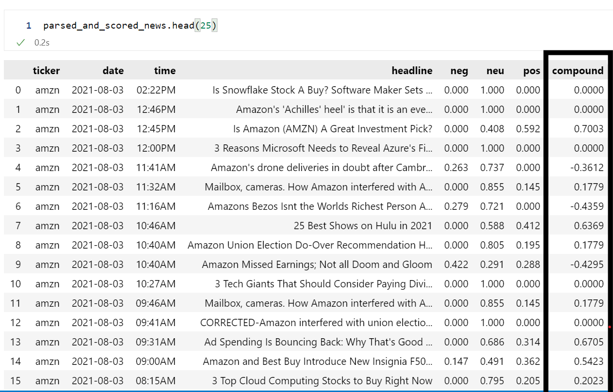

    - The compound values are then aggregated date-wise to get a meanscore dataframe.

    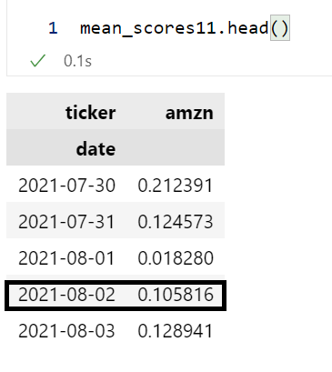

- ***Yfinance Library***
    - Yfinance is used to obtain the stock prices for the ticker and S&P500, NASDAQ, DOW30 index closing values.
    - A 2wk (week) period is considered for the price charts so that we can compare the price movements with the sentiment score. 
    - Important to remember that the **sentiment score of t0 is seen in the price movement of t1**

- ***Dash Plotly Express Library***
    - Plotly express is used to create that charts for sentiment analysis and price movements.
    - Dash app is used to create a web page which can display charts on a web page and the user can interact with the chart and Dash interacts with the python code and displays the updated chart. 

    **Test Case A:**
    - Amazon stock was chosen to see the impact of sentiment analysis and its impact on the stock price.
    - As we can see the sentiment chart on **08/02/21 showed an uptick** and this can be seen in the **~ 1.2% increase in the stock price on 08/03/21** 

    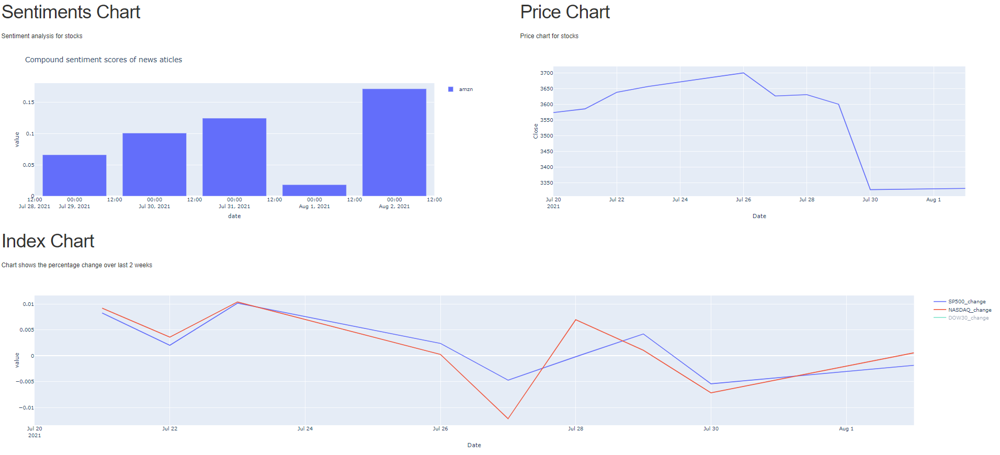

    

     

    **Test Case B:**

    - Ford Motors stosck was chosen. 

    - News reports snapshot show that the sentiment of the news changed from negative to positive from July 24 to July 28. 

    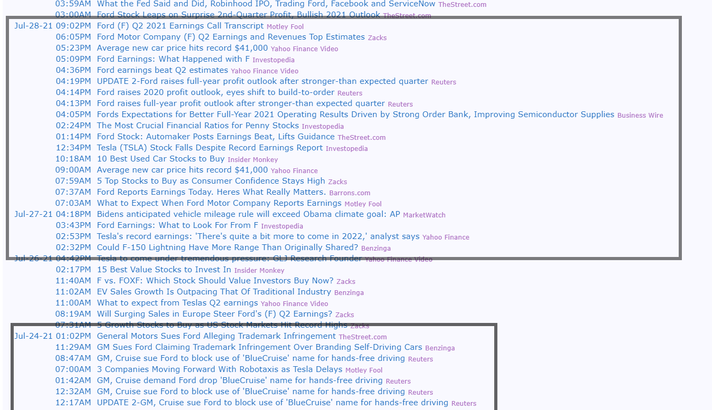
    

    - Ford Charts also show the price increase on July 29

     insert words here. 
​
**Imports and libaries:** 
​
​
## Sentiment Analysis: Social Media - John  A Kelly
* This section covers more detailed sentiment analysis involving a **social media** source as opposed to an open news source.
* Non-professional investors are overwhelmingly making decisions on emotion and FOMO-related impulses they read about on social media as opposed to objective research. 
* We decided to use **Twitter** as our social media source as we had gotten an approved Twitter developer account that provided the official Twitter API keys, and the Twitter developer portal is very user-friendly.
* When a user queries a stock in the dashboard, it will display the prioces as well as a graph visual of sentiment polarity scores of Twitter users tweeting about the company.
* When the user enterts the stock ticker in the dashboard, the program will also store that ticker into a query variable to pass to the Twitter API.
* Twitter API will scrape Twitter for recent archived tweets on the subject, clean the tweets into direct tokenzied words, and assign polarity and emotional values to those tweets, and finally return a simple plotly graph to the dashboard about people's feelings about the stock.
* So the user has price, price prediction, and sentiment about the stock to make a decision. 

**Imports and libaries:**

* tweepy - *pip install tweepy* - This is a library that interacts with Twitter API to scrape raw tweets data from the platform. 
* textblob - *pip install textblob* - This will allow us create visuals of tokenized words and sentences of the tweets we collect into categorial segments.
* os, dotenv, and load_dotenv - to bring in our API keys securely into the main program.
* Standard NLP libraries like nltk.
* wordcloud & pillow - build wordclouds with the tweets sentiment. 
* webbrowser and time - these are somewhat standard libraries and do not really require a stand alone. These will redirect users to Twitter authorization url to get our **access token** with our Twitter API keys. 
* matplotlib
* plotly express
* pandas - to make our dataframes.
* re - to replace and substitue unwanted Twitter elements out of the data when data cleaning. 

**Limitations:**

* To do this section, you need **Twitter API keys** which can only be obtained by having an **approved Twitter developer account.** 
* The Twitter API keys alone will not allow data scraping. Any app or code notebook will require an access token using the API keys.
* Tweepy will use the access token to scrape the data.
* You are only permitted 500,000 tweets per day. 
* API is **rate limited** to **20 tweets** per API call for @Twitter handlles.
* You can get more tweets data if we search by a #hashtag subject, using the but this will require extra code to pull the tweets data, and extra cleanup code to streamline the text data.
* The tweepy **Cursor** function will be able to collect more tweets.
* You can only get the past **5-7 days worth of recent** tweet data on a subject.
* Multiple API calls can trigger a rate-limit issue or a token authorization issue. To fix this you'll need to go back into the Twitter developer portal and regenerate new API credentials and update your environment variables.

**STEP 1: Imports**

* We will need the **tweepy** library installed in our environment. It is pronoucned 'twee-py'.

> pip install tweepy

* We will also need the **text blob** library too. This will be used to visualize polarity scores of tweets and other graphs we want to make.

> pip install textblob

* We will also bring in the **os**, **dotenv**, and **load_dotenv** imports to bring in the Twtter API and secret keys.

* And any other import libraries we use for NLP functions.

**STEP 2: Store the API keys**

* In tweepy, we need to store our API keys in specific variables called **consumer_key** and **consumer_secret**

* We use **os.getenv** to read our API into the program and store in these resepctive variables.

* Twitter doesn't simply allow the API keys alone to be able to scrape Twitter data. Getting an approved developer account and API keys is the first step. Tweepy needs an access token made from these API keys.

**STEP 3: Create a Tweepy API Object to scrape Twitter**

* After bringing in our .env file, storing our Twitter API credentials, we'll need an **access token** to initialize tweepy. To get this access token we need a **PIN number** provided by the Twitter developer portal.

* We need the Twitter API to get this PIN number. And the PIN number will create an access token, mapping our API credentials to the token. And we will create an API object using tweepy that will use this access token.  
* We will have all this code in jupyter notebook cell. This will handle authorizing and creating the tweepy API object needed to scrape tweets. 

* First we need to create a callback **uniform resource indicator** to manage data returned from the API from uncommon sources. Twitter has all kinds of data-types in tweets and posted by various sources. We will set the uri to be **oob** or out-of-band value for these purposes.

* Create an authentication object for tweepy using **OAuthHandler** and we pass in our **consumer_key**, **consumer_secret**, and **callback_uri**. We are using OAuth1.

* We store a redirect url variable. This will hold the authorzation website that we get the PIN number from.

* **webbrowser** will auto-open the redirect url instead of having to copy-paste. You will see this. Click **Authorize App** button.  In order to use this website, we need to have a Twitter developer account. 

* A 7-digit **PIN** will appear. Copy this PIN. You'll get a new PIN every time you run the authorization cell. 

* Enter the PIN at the input prompt we coded in. Hit enter.

* You will see the access keys/token and secret token print out.

* **NOTE:** Your access keys will not change regardless how many times you re-run this cell and get a new PIN number. The access keys are always tied to the API keys.  

* the final line of code in this cell creates the tweepy API object itself. It will hold the access tokens. An optional parameter to pass in is **wait_on_rate_limit=True** which deals with the rate limit on API calls made to Twitter.

**STEP 4: DataFrame of Tweets**

* We will scrape 1000 tweets and put into a pandas DataFrame

* This dataframe will have 1 column called **Tweets**

* Define our search topic by declaring a variable and storing a '#hashtag' I chose dogecoin

**STEP 5: CLeanup**

* We want to get rid of all unecessary tweet elements like emoji's, videos, images, ASCII art.
* We want sentiment from organic authored tweets. Clean up re-tweets, ads, and spam.

* Define an emoji script. This will be used.

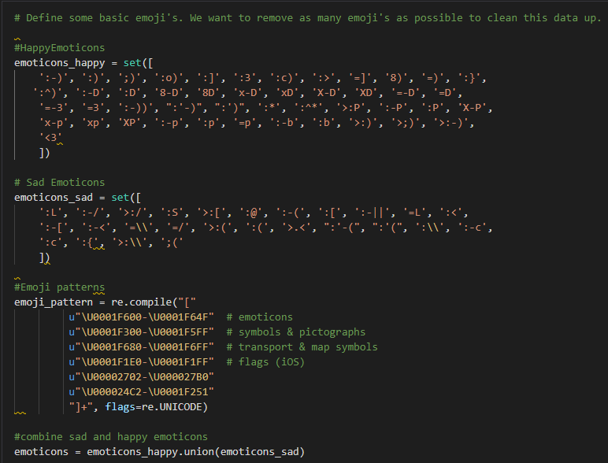

* Define a **clean_tweets** function to substitue out all unwanted emoji's and data-types

**STEP 6: Subjectivity and Polarity** 

* Subjectivity measures the emotional tone of a tweet whether it's objective or subjective. It ranges from 0-1. Zero is objective and 1 is subjective. 

* Define both a subjectivity and polarity functions to apply new columns and scores of each tweet collected.

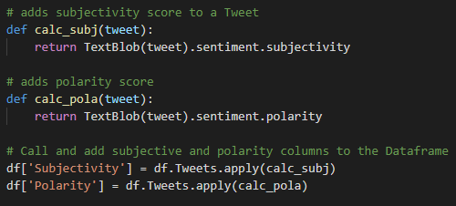

* Add sentiment labels to the polarity scores with **positive**, **negative**, and **neutral** labels.

* Final cleaned up tweets dataframe

**STEP 6: Visualize the Sentiment in Graphs and Word Cloud**

* Make a scatterplot

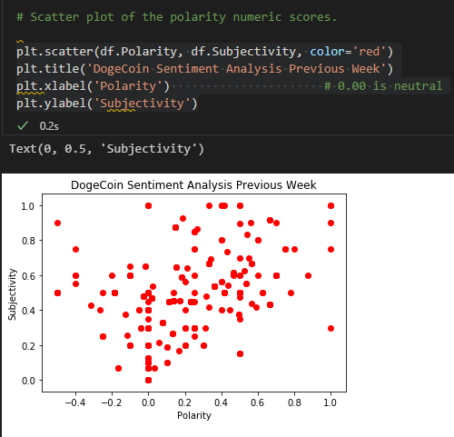

* Make a plotly express pie chart

* Make a word cloud

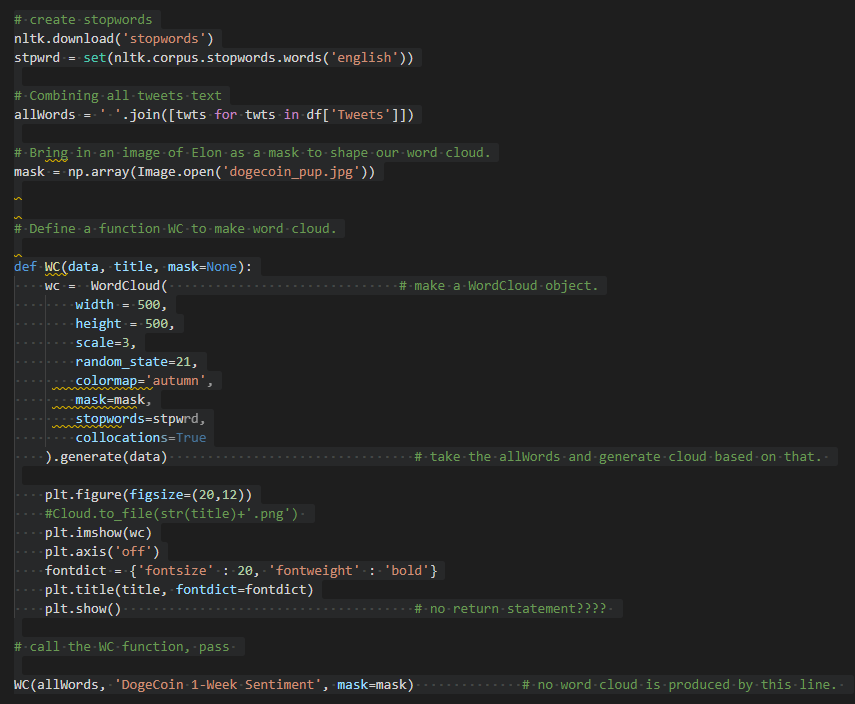

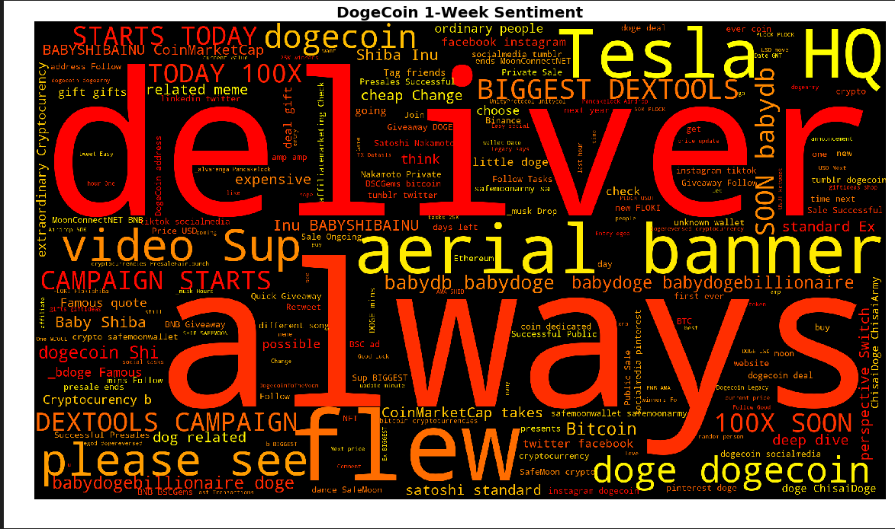

​
​
​
​
​
​
​
​
​
​
​
​
## LSTM Time-Series Prediction Analysis - Joanne Gates
#### LSTM is an artificial recurrent neural network(RNN) used in the field of deep learning, this model is widely used for sequence prediction problems and have proven to be extremely effective. I am going to predict the closing stock price for Apple, using the past 60 day stock price. Data pulled from Yahoo Finance using web.DataReader. Data is from 2011/7/31-2021/7/31. Graphs showing below are using matplotlib, Plotly express and dash. 

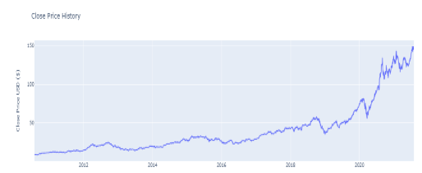

#### Then I created 80% training data set and 20% testing data set and scale the data set to be values between 0 and 1. My X_train data set contains value from index 0-59(60 days), y_train will be index 60 (61st day). Then build the LSTM model to have 2 LSTM layers with 50 neurons and 2 dense layers with 25 and 1 neurons. Compile the model using MSE (mean squared error) loss function and the Adam optimizer. Then I calculated the RMSE (root mean squared error), the lower the value the better the model performed. My result is 10.66. I polted the real vs. predict graphs in ways using Matplotlib, Plotly express and Dash. The first 3 graphs showing the testing data set real closeing price vs. predicted prices. The last 2 graphs showing the training(train), real(valid) and predicted (predictions) prices. 

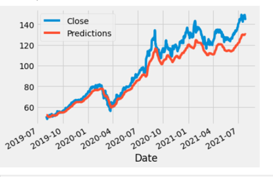

#### I want to test the model some more and get the predicted closing price value of Apple. for 07/30/21. My predicted value is $ 127.75 the real price is $ 145.86.

> insert words here.
Collapse

Send a message to John A Kelly, Sumitha Prabhu, Zeray Admasu

