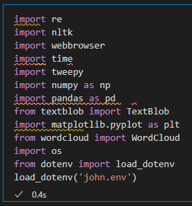
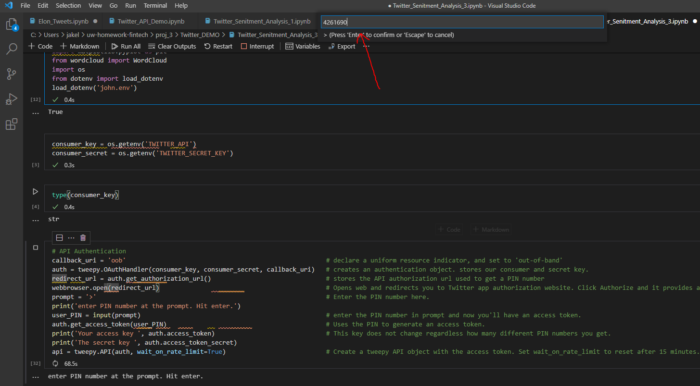

# Twitter Sentiment Analysis - Elon Musk - How To Guide

* This document will the details to perform basic Twitter analsysis using the Twiiter API on accounts of interest such as, Elon Musk.
* Before we begin scraping Twitter accounts, we will first need to be approved for a Twitter developer account to get an API.

## Imports Needed

* We will need the **tweepy** library installed in our environment. It is pronoucned 'twee-py'.

> pip install tweepy

* We will also need the **text blob** library too. This will be used to visualize polarity scores of tweets and other graphs we want to make.

> pip install textblob

* We will also bring in the **os**, **dotenv**, and **load_dotenv** imports to bring in the Twtter API and secret keys.

* And any other import libraries we use for NLP functions.

## Twitter API

* In tweepy, we need to store our API keys in specific variables called **consumer_key** and **consumer_secret**

* We use **os.getenv** to read our API into the program and store in these resepctive variables.

* Twitter doesn't simply allow the API keys alone to be able to scrape Twitter data. Getting an approved developer account and API keys is the first step. Tweepy needs an access token made from these API keys. 

## Authentication and Creating an API Object

* After bringing in our .env file, storing our Twitter API credentials, we'll need an **access token** to initialize tweepy. To get this access token we need a **PIN number** provided by the Twitter developer portal.

* We need the Twitter API to get this PIN number. And the PIN number will create an access token, mapping our API credentials to the token. And we will create an API object using tweepy that will use this access token.  

### Getting the Access Token

* We will have all this code in jupyter notebook cell. This will handle authorizing and creating the tweepy API object needed to scrape tweets. 

* First we need to create a callback **uniform resource indicator** to manage data returned from the API from uncommon sources. Twitter has all kinds of data-types in tweets and posted by various sources. We will set the uri to be **oob** or out-of-band value for these purposes.

* Create an authentication object for tweepy using **OAuthHandler** and we pass in our **consumer_key**, **consumer_secret**, and **callback_uri**. We are using OAuth1.

* We store a redirect url variable. This will hold the authorzation website that we get the PIN number from.

* **webbrowser** will auto-open the redirect url instead of having to copy-paste. You will see this. Click **Authorize App** button.  In order to use this website, we need to have a Twitter developer account. 

* A 7-digit **PIN** will appear. Copy this PIN.

* Enter the PIN at the input prompt we coded in. Hit enter.

* You will see the access keys/token and secret token print out.

* **NOTE:** Your access keys will not change regardless how many times you re-run this cell and get a new PIN number. The access keys are always tied to the API keys.  

* the final line of code in this cell creates the tweepy API object itself. It will hold the access tokens. An optional parameter to pass in is **wait_on_rate_limit=True** which deals with the rate limit on API calls made to Twitter.

## Scraping Twitter

* We need to set the user we want the API to look at. This the **@handle** on the Twitter account.

* Next we need to extract that accounts' timeline of tweets.

* A few things to note: Twitter only permits **20** tweets per API call. And it only fetches the most current 20 tweets on the user timeline on the **current day.** This is the **rate limit** imposed by Twitter itself.

* Let's see the followers and friends count.

* In Twitter, *followers* are people who follow the user account. Friends are who the user is following.
* We want a user with lots of followers and very few friends. A high friends number indicates the account might be a bot.
* A **blue verified checkmark** are the target accounts we want to use for business analsysis. Every government official or business brand and their corporate leaderships gets these indicators on their account.  

* Put all the raw tweets from the timeline into a DataFrame using an in-line for-loop to grab all the tweets.
* Our DataFrame will only have 1 column called **Tweets**

## Cleanup

* Twitter posts contain various data types and objects that are not useful for analyzing content. We will remove these items such as @ mentions, # hastags, retweets, any non-text items. We only want tweets authored by Elon himself.

* define a function for cleaning tweets called **clean_tweets**

* Our DataFrame will look cleaner. I have no figured out how to remove emoji symbols.

## Subjectivity and Polarity

* **Subjectivity** analyzes and scores passed words based on their objectivity. It ranges from 0-1. Zero meaning the tweet was mostly objective. While 1 means the author was more subjective.

* **Polarity** measures and scores the emotion of the tweets such as **positive**, **negative**, and **neutral**.

* Define functions to pass in tweets and apply scoring functions on subjectivity and polarity. And we will add in columns to our DataFrame to reflect these scores.

* Now we need to add labels to our **polarity** scores. That is labeling them positive, negative, or neutral. We'll define a function called **senitment** to pass in a tweet and measure and label its polarity score. 
* We are only passing in the **polarity** colummn.

* We will have a Sentiment column

## Save the Tweet data to a csv file

## Word Cloud

